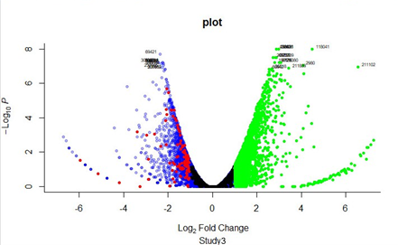

Expression analysis of RNA sequencing samples with volcano plot. 
================

##### Ahmed I. Alrefaey (12/03/2020)

### Introduction

Generally, differences in gene expression among tested transcripts are defined by a fold change function. This function compares the abundance of transcripts under control versus experimental conditions. Therefore, it is important to use a statistical method to assess the significance of differences among transcripts. The significance of fold change among expressed transcripts could be ranked through a score value which can be estimated by a statistical model. Most RNA sequencing analysis uses adjusted p-values as a score threshold to confirm the fold change. Differential expression analysis was performed using DESeq in R software. DESeq algorithm performs a pairwise comparison between control and stressed transcripts (Love et al., 2014). Transcripts with statistically significant differences between treatments will be identified based on an overall false discovery rate (FDR). FDR score is assigned to each gene based on changes in gene expression relative to the standard deviation of repeated measurements. Only transcripts with a cutoff of adjusted P-values less than 0.05 and the calculated fold changes (a log 2-fold change) between the control and the treatment exceeding 1.5, were considered as differentially expressed.

#### 1. Installing the required R packages:

``` bash
> install.packages("calibrate")
> library(calibrate)
> library(dplyr)
> library(ggplot2)
> library(ggrepel)
```

#### 2. Expression quantification.
Once good-quality raw reads have been identified and aligned to the reference genome, the next step is to quantify gene expression by filtering differentially expressed genes through a standard statistical tool, e.g. DESeq2. 
``` bash
> Study3 <- read.delim("C:/Users/ad2n15/Desktop/Book1.txt")
> View(Study3)
> plot(Study3$lo400rRNA_vs_lo730rRNA.log2fc,Book1$lo400rRNA_vs_lo730rRNA.fdr)
> SS = -log10(Study3$lo400rRNA_vs_lo730rRNA.fdr)
> x= filter(Book1, ss < 1e-100)
> padj=Study3$padjwith(subset(Study3 , padj<0.05), points(log2fc, (fdr), pch=20,col="black"))
> cutoff=sort(Study3$lo400rRNA_vs_lo730rRNA.fdr)[20]
> sign.genes=which(Study3$lo400rRNA_vs_lo730rRNA.log2fc <= cutoff)
```

#### 3. Label the statistically significant expressed genes:
To add an identifier to the gene name column in the DEseq2 table. 
``` bash
> with(subset(Study3, abs(-log10(fdr))> 6.8), pos=4, cex=0.8, textxy(log2fc, -log10(fdr), labs=gene.name)) 
```
#### 4. Plot the RNA-seq gene expression results.
Volcano plot will be produced to interpreting gene expression data to represent significant up-regulated and down-regulated genes.

``` bash
plot (Study3$log2fc, (Study3$fdr), type = "p", pch=20, col=rgb(0,0,1,.3), xlim=c(-7,7), ylim = c(0, 10), xlab= bquote(~Log[2]~ 'Fold Change'), ylab= bquote(~-Log[10]~italic(P)), axisLabSize = 12, pCutoff = 500, FCcutoff = 10, bty="l", main = "plot", sub = "Study3")
with(subset(Study3 , padj<0.05), points(log2fc, (fdr), pch=20,col="black"))
with(subset(Study3 , padj>0.05), points(log2fc, (fdr), pch=20,col="black"))

with(subset(Study3, (log2fc)>1), points(log2fc, (fdr), pch=20, col="green"))
with(subset(Study3, (log2fc)<(1*-1)), points(log2fc, (fdr), pch=20, col="red"))
with(subset(Study3, abs((fdr))> 7.8), pos=10, cex=0.8, textxy(log2fc, (fdr), labs=gene.name))
```


The volcano plot shows the fold change (Log2 Ratio) plotted against the significance (-Log10 adjusted p-value). The significance of expressed genes was estimated based on the FDR threshold < 0.05. Significant up-regulated and down-regulated genes are annotated as green and red dots, respectively, on the plot labelled with each transcript name.
